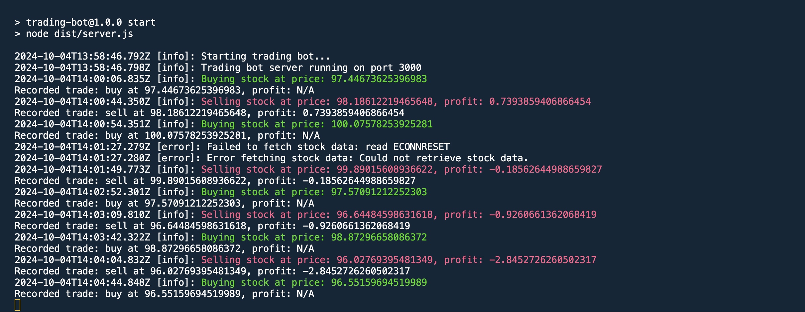

# Trading Bot Backend (Node.js with TypeScript)

## Setup

1. Install dependencies:

    ```bash
    npm install
    ```

2. Run the TypeScript build:

    ```bash
    npm run build
    ```

3. Start the server:

    ```bash
    npm start
    ```

4. Use Docker to run the app:

    ```bash
    docker build -t trading-bot .
    docker run -p 3000:3000 trading-bot
    ```

## Features

- Simulates stock price movements using mock data.
- Implements a simple trading strategy:
    - **Moving Average Crossover Strategy**.
    - Buy when the short-term moving average crosses above the long-term.
    - Sell when the short-term average crosses below the long-term.
- Tracks all trades and profit/loss.
- Generates structured logs with **Winston**.



